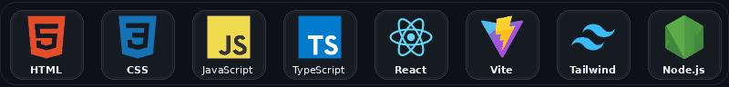

# Hola, soy Norbey Ruales 👋

### Desarrollador de software | React, TypeScript y Supabase

Construyo aplicaciones web enfocadas en resolver necesidades reales de negocios, con interfaces claras, bases de datos seguras y despliegues listos para producción.

## Sobre mí

- 🎓 Estudiante de Tecnología en Desarrollo de Software en la Universidad del Valle, sede Yumbo.
- 💻 Desarrollo aplicaciones web con React, TypeScript, Vite y Supabase.
- 🧩 Me interesa convertir procesos manuales en herramientas digitales organizadas y fáciles de usar.
- 🔐 Trabajo en autenticación, bases de datos, seguridad con RLS, operación offline y despliegues en Vercel.
- 📍 Colombia.

## Tecnologías y herramientas

  

## Proyectos destacados

### 🛒 Punto de Venta Completo

Sistema POS para tiendas minoristas con ventas, inventario, caja, clientes, proveedores, compras, recargas y reportes. Incluye autenticación con Supabase, rutas protegidas y funcionamiento online/offline con sincronización de cambios.

**Tecnologías:** React, Vite, Supabase, Tailwind CSS y Recharts.

  
  

---

### 🧰 Gestión de Servicios

Aplicación para administrar clientes, sedes, equipos, órdenes de trabajo, facturación, pagos y reportes. Cuenta con autenticación, control de acceso, base de datos relacional, políticas RLS y funciones de Supabase.

**Tecnologías:** React, TypeScript, Vite, Supabase, Tailwind CSS y Vitest.

  
  

---

### ⚓ Bahía Nacho

Plataforma web en desarrollo para un negocio de repuestos y servicios de motores fuera de borda. Incluye catálogo público, búsqueda de productos, portal de clientes, inventario, panel administrativo, roles, permisos y auditoría.

**Tecnologías:** React, TypeScript, Vite, Supabase, Tailwind CSS y Recharts.

**Estado:** 🟡 En desarrollo

  

## Actualmente

- Desarrollando y preparando el despliegue de Bahía Nacho.
- Mejorando la seguridad, accesibilidad y experiencia de usuario de mis aplicaciones.
- Profundizando en React, TypeScript, Supabase y arquitectura de aplicaciones web.

## Contacto

Puedes encontrarme y revisar mis proyectos en [GitHub](https://github.com/NorbeyRuales).

Gracias por visitar mi perfil.

